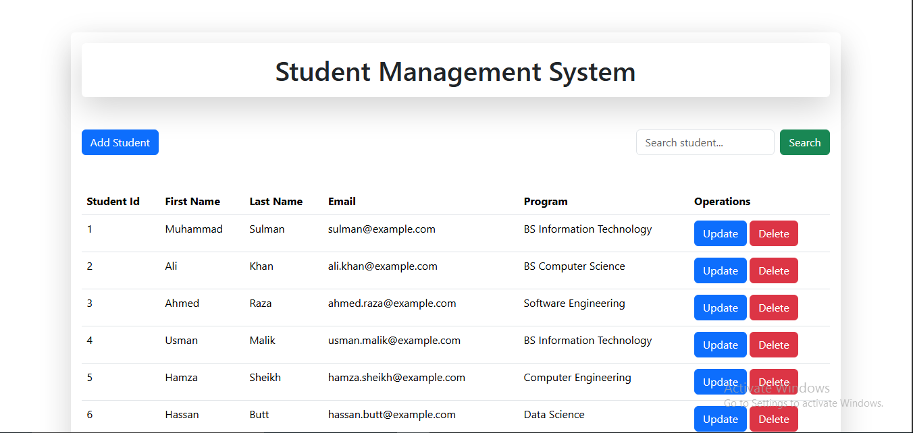
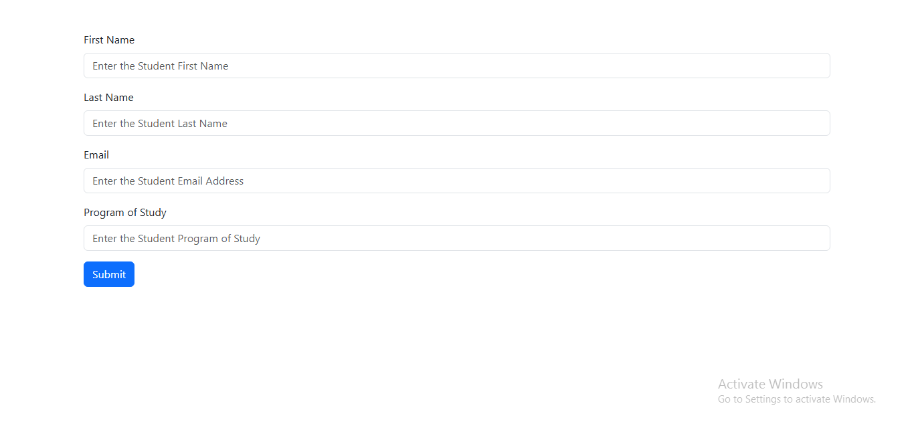
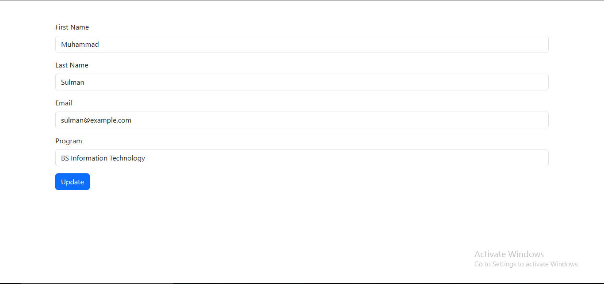
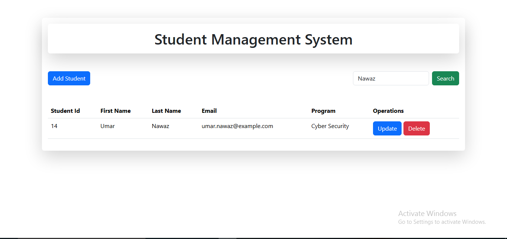
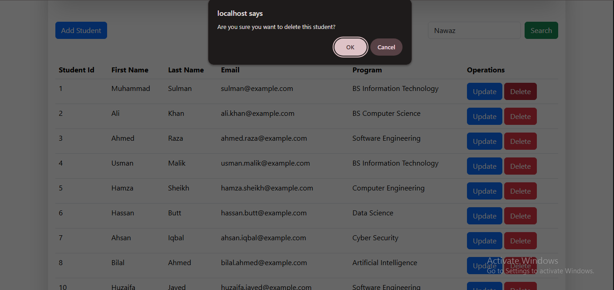

# 🎓 Student Management System (PHP & MySQL)

A full-stack Student Management System built using **PHP, MySQL, HTML, CSS, and Bootstrap**. This application allows users to add, update, delete, search, and manage student records through a clean and responsive interface.


---

## 📸 Project Screenshots

### 🏠 Home Page



---

### ➕ Add Student



---

### ✏️ Update Student



---

### 🔍 Search Student



---

### 🗑️ Delete Student



---

## 🚀 Features

- Add New Student
- Update Student Information
- Delete Student Records
- Search Students
- View All Students
- Responsive User Interface
- MySQL Database Integration
- Secure Prepared Statements (SQL Injection Protection)

---

## 🛠️ Technologies Used

- HTML5
- CSS3
- Bootstrap 5
- PHP
- MySQL
- XAMPP (Apache + MySQL)

---

## 📁 Project Structure

```text
studentdb/
│
├── connection.php
├── insert.php
├── update.php
├── delete.php
├── display.php
├── studentdb.sql
└── README.md
```

---

# 📥 Installation Guide

Follow the steps below to run this project on your computer.

## Step 1 — Install XAMPP

Download and install **XAMPP**.

Start the following services:

- Apache
- MySQL

---

## Step 2 — Download the Project

Download this repository as a ZIP file or clone it using Git.

Extract the ZIP file.

---

## Step 3 — Copy the Project

Copy the **studentdb** folder and paste it into your XAMPP **htdocs** directory.

Example:

```text
C:\xampp\htdocs\studentdb
```

---

## Step 4 — Create the Database

Open your browser and visit:

```text
http://localhost/phpmyadmin
```

Create a new database named:

```text
studentdb
```

---

## Step 5 — Import the Database

Select the **studentdb** database.

Click:

**Import**

↓

Choose the file:

```text
studentdb.sql
```

↓

Click **Import**.

This will restore all required tables and sample data for the project.

---

## Step 6 — Check Database Connection

Open:

```text
connection.php
```

Make sure the database configuration is:

```php
$conn = new mysqli("localhost", "root", "", "studentdb");
```

---

## Step 7 — Run the Project

Open your browser and visit:

```text
http://localhost/studentdb/display.php
```

The Student Management System should now be running successfully.

---

## 📊 Database

This project includes:

- Database Backup (`studentdb.sql`)
- Sample Student Records
- Complete Table Structure

Simply import the SQL file to restore the project.

---

## 👨‍🎓 Student Information

Each student record contains:

- Student ID
- First Name
- Last Name
- Email Address
- Program of Study

---

## 🤝 Contributing

Contributions, suggestions, and improvements are welcome.

Feel free to fork this repository and submit a Pull Request.

---

## 📄 License

This project is created for learning and educational purposes.

---

## 👨‍💻 Author

**Muhammad Sulman**

GitHub:
https://github.com/muhammadsulmanofficial

---

⭐ If you found this project useful, please consider giving it a **Star**.
